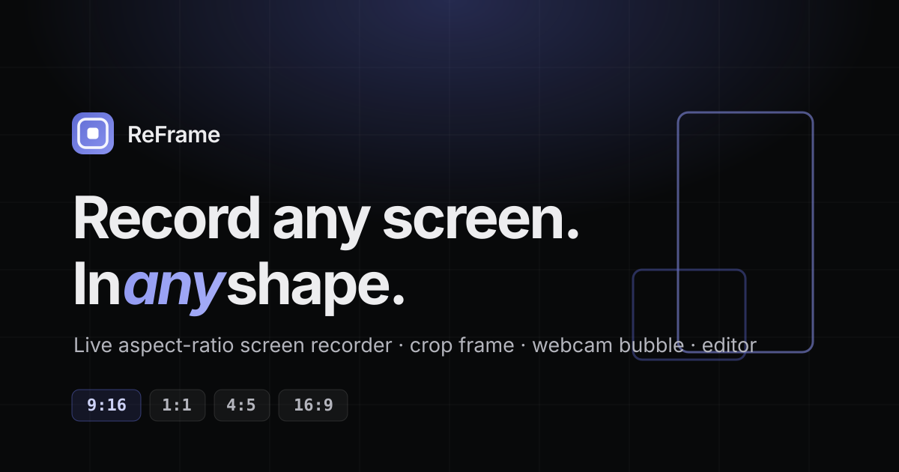
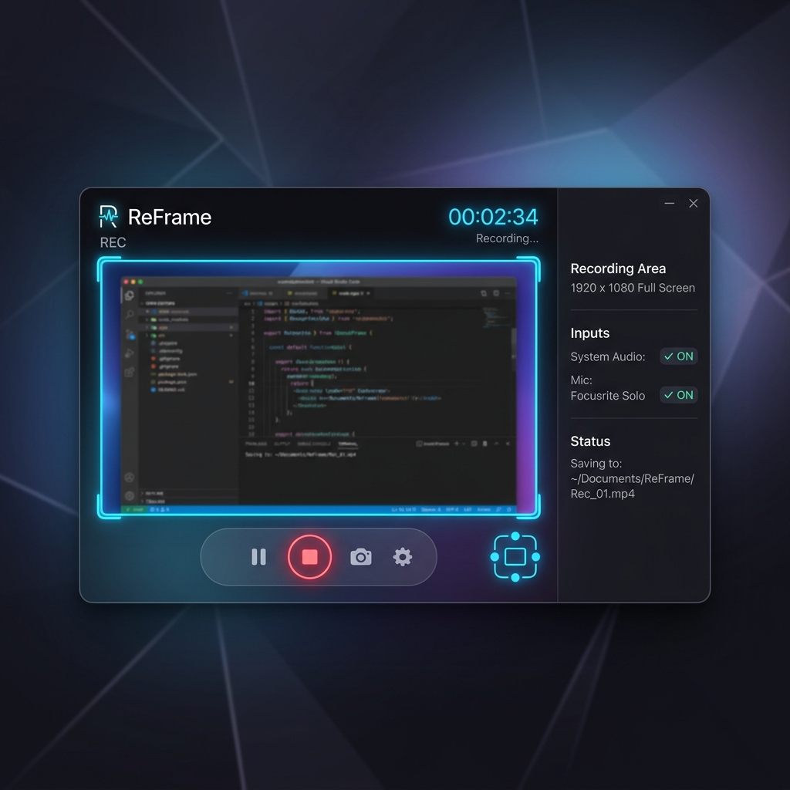

<div align="center">



# ReFrame

### Record any screen, in any shape.

A **live aspect-ratio screen recorder & editor**. Drag a ratio-locked crop frame over your screen and record **vertical, square, or wide** — no window juggling. Webcam bubble, multi-source capture, live retake, background removal, and a built-in editor. Runs **100% locally**.

<br/>

[](https://reframe-landing-two.vercel.app/app)
[](https://github.com/mehulk05/ReFrame/releases/latest/download/ReFrame-Setup-Windows.exe)
[](https://github.com/mehulk05/ReFrame/releases/latest/download/ReFrame-Setup-macOS.dmg)

<br/>


<br/>



</div>

---

## Why ReFrame?

Recording a 16:9 desktop for a 9:16 Reel means everything important gets cropped out. ReFrame flips it: **pick your output shape first**, then drag a ratio-locked frame over exactly what you want. What's in the frame is what gets recorded — pixel-perfect, every time.

---

## ✨ Features

### 🎥 Capture
| Feature | What it does |
|---|---|
| **Aspect-ratio crop frame** | Pick **9:16 / 1:1 / 4:5 / 16:9 / 3:4**, drag a ratio-locked box anywhere on screen — only that region records, at your exact output resolution. |
| **Fit mode (never crop)** | Fit a whole landscape screen into a vertical frame with a **blurred / solid / gradient** background fill instead of cropping. |
| **Camera (selfie) mode** | Record yourself full-frame in any ratio, with **0.5× / 1× / 2× zoom**, a blurred surround, and a **mirror** toggle. |
| **Multi-source** | Capture **up to 3 screens/windows** at once, tiled automatically (stacked for vertical, side-by-side for wide). |
| **Webcam overlay** | A draggable, resizable **camera bubble** — circle / rounded / square — or a **split/stack** layout. Optional **background removal** (no green screen, via MediaPipe). |
| **Audio** | Microphone (device picker + live level meter + **noise suppression**) and **system audio**, mixed together. |
| **Countdown + timer** | 3-2-1 / 5s count-in, a live recording timer, and **pause / resume**. |
| **Live retake** | Hit **Keep** at a safe point, **Retake** to scrap back to it with a count-in — flubs are auto-trimmed in the editor. |
| **On-screen frame guide** *(desktop)* | A glowing outline of the recorded region drawn on your **real desktop**, so you can see the frame while demoing other apps — and **drag it to reposition** the recording live. |

### ✂️ Editor
| Feature | What it does |
|---|---|
| **Trim & multi-cut** | Set in/out points, then drag across the timeline to remove dead air — multiple cuts, each movable/resizable, with an **audio waveform** so you can see the silences. |
| **Timed captions** | Add multiple captions, **drag each to position** on the video, set its **start/end** seconds, size and color. |
| **Annotations** | Draw **boxes and arrows** over the footage. |
| **Speed** | Presets plus **custom 0.1×–8×**. |
| **Audio & color** | Mute / volume, and **brightness / contrast / saturation**. |
| **Multi-ratio re-export** | Render one recording to **several aspect ratios at once** (auto-reframed with a blurred fill). |

### 📤 Output & UI
- **MP4** (native) or **WebM** export at your chosen ratio & resolution.
- **Light / Dark theme** with a toggle (synced across the site and the app).
- Recordings library with inline preview, rename, download, and non-destructive editing — all stored **locally** in your browser/app.

---

## 🚀 Get ReFrame

| | |
|---|---|
| 🌐 **Try in browser** (no install) | **<https://reframe-landing-two.vercel.app/app>** |
| 🪟 **Windows — installer** | [ReFrame-Setup-Windows.exe](https://github.com/mehulk05/ReFrame/releases/latest/download/ReFrame-Setup-Windows.exe) |
| 🪟 **Windows — portable** (no install) | [ReFrame-Portable-Windows.exe](https://github.com/mehulk05/ReFrame/releases/latest/download/ReFrame-Portable-Windows.exe) |
| 🪟 **Windows — zip** (unpack & run) | [ReFrame-Windows.zip](https://github.com/mehulk05/ReFrame/releases/latest/download/ReFrame-Windows.zip) |
| 🍎 **macOS** | [ReFrame-Setup-macOS.dmg](https://github.com/mehulk05/ReFrame/releases/latest/download/ReFrame-Setup-macOS.dmg) |
| 📦 **All releases** | <https://github.com/mehulk05/ReFrame/releases> |

> **First launch:** the builds are unsigned. **Windows** → SmartScreen → *More info* → *Run anyway*. **macOS** → right-click the app → *Open*, and grant **Screen Recording** permission in *System Settings → Privacy & Security*.

---

## 🎬 How to use

**Record**
1. **Source** — choose *Screen*, *Camera*, or *Multi*.
2. **Aspect ratio** — pick 9:16 / 1:1 / 16:9 / … and an output resolution.
3. *(optional)* Add a **webcam bubble**, turn on **mic / system audio**, set a **countdown**.
4. **Select screen / window**, drag the frame over what you want, hit **Start recording**.
5. While recording: **Keep** ✓ / **Retake** ↺, **Pause**, or drag the on-screen guide to reframe.
6. Your take lands in **Recordings** — preview, rename, download, or **Edit**.

**Edit**
1. Open a recording → **Edit**.
2. **Trim** the ends, toggle **Drag-to-cut** and drag over dead air (watch the waveform).
3. **Add captions** (drag to place, set when they show), **boxes/arrows**, **speed**, **color**.
4. **Export** — pick one ratio or several at once; the result saves back to Recordings.

---

## 🖥️ Run from source

**Web app** (recorder + editor) — any static server over HTTPS or `localhost` (screen capture needs a secure context):
```bash
cd app
python -m http.server 8000
# open http://localhost:8000
```

**Desktop app** (Electron):
```bash
cd desktop
npm install
npm start            # run it
npm run dist:win     # build the Windows installer + portable + zip  (→ dist-app/)
npm run dist:mac     # build the macOS .dmg  (run on a Mac)
```

**Landing page** — pure static HTML/CSS/JS, no build step.

---

## 🏗️ Build & release (CI)

Pushing a version tag builds **Windows + macOS** installers on GitHub Actions and publishes them to a Release with stable filenames:

```bash
git tag v1.0.3
git push origin v1.0.3
```

The "Download" links above always point at `releases/latest/download/…`, so they auto-update with each release.

---

## 📁 Repository structure

```
ReFrame/
├── index.html · styles.css · app.js   # landing page (deployed to Vercel)
├── app/                                # web build of the app
│   ├── index.html                      #   recorder
│   └── editor.html                     #   editor
├── desktop/                            # Electron source (built by CI)
│   ├── index.html · editor.html · frame-guide.html
│   ├── main.js · preload.js · package.json
│   └── build/                          #   icon + entitlements
├── .github/workflows/release.yml       # tag → build Win+Mac → GitHub Release
└── favicon.svg · og.svg · mockup.png   # brand assets
```

---

## 🔒 Privacy

Everything runs **on your machine** — capture, editing, and storage are entirely local (IndexedDB in the browser/app). Nothing is uploaded. The only network calls are for fonts and the Three.js hero on the landing page.

## 🛠️ Built with

Vanilla JS · Canvas / `MediaRecorder` · `getDisplayMedia` · MediaPipe Selfie Segmentation · Electron · electron-builder · Three.js (landing hero) · deployed on Vercel.

## 📄 License

MIT © [Mehul Kothari](https://github.com/mehulk05)
